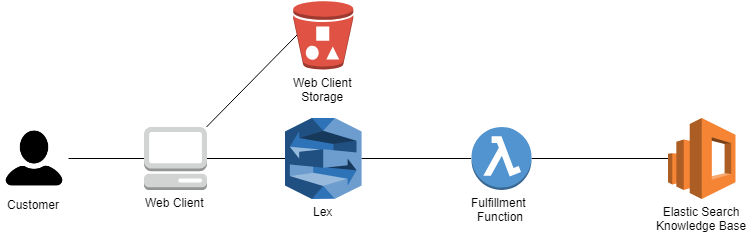
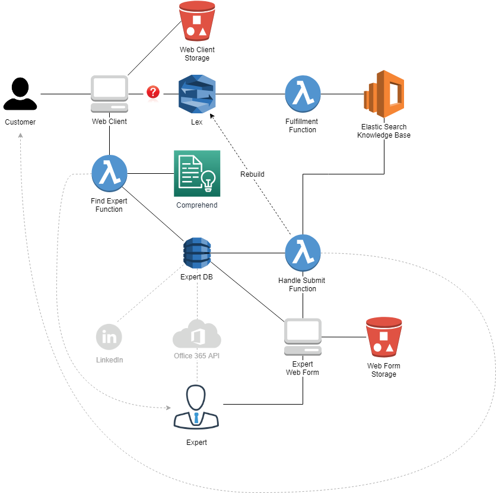

# Introduction 
HAL is an expert chatbot that will improve its knowledge from the organization's experts and provide automatic answers to new questions the after sales team may have.

# AWS Services Used
- Lambda Functions
- Lex
- Elastic Search
- S3
- API Gateway
- Comprehend
- DynamoDB
- SES

# Demo

## Links
- [Chatbot client](https://s3.amazonaws.com/hal-bot/client.html)
- [Stats and admin page](https://s3.amazonaws.com/hal-bot/stats.html)
- [Q&A designer](https://bju7yzad46.execute-api.us-east-1.amazonaws.com/prod/pages/designer) (User: Admin  Pass: W**********!)

## Personas

End-Users:
- Scarlet Johansson 
- Brad Pitt
- Angelina Jolie 

Experts: 
- Dwayne Johnson 
- Ridley Scott
- Peter Jackson 
- Jennifer Lawrence 
 
Please check stats page to know which skills are configured for each expert.


## Known Questions
- To restart an automatic watch that has stopped, should I shake it?

## Unknown Questions
- How long is the life of a battery? => Dwayne Johnson
- Why does my leather strap need changing so quickly? => Peter Jackson
- Any questions with unknown skills will be handled by Ridley Scott

# Architecture

## Handle Known Questions




All the questions understood by this bot are stored in the Elastic Search DB, also seen as Knowledge Base. Using Elastic Search allows some degree of fuzziness when querying the DB to find a specific answer. AWS Lex bot is used to understand and handle the conversation with the end-user. If the question is understood by Lex, a Lambda function will handle the query to the Elastic Search and provide the respective result to the end-user.

In the case that a question is not understood by the bot, the Lex will return a static text to the web client and there is no way to handle it via a lambda function. This would be nice to have from the Lex so that we could forward the question to an expert. For this reason, we decided to implement the handling of unknown questions on the client side. This process is explained in the section below.

## Handle Unknown Questions

As mentioned above, the handling of unknown questions is handled on the web client. This is due to a limitation on the Lex component that can only return a string when it is not able to parse a specific question.



In the case that the bot can't find an answer for the question asked on the knowledge base, the web client identifies this issue and ask the user if he wants to contact an expert. If the user answers positive, a lambda function is called (via an API Gateway method) that will find an expert and sends him an email with the question asked. 

The selected expert will receive a link that he can use to provide the answer to the question asked. Once this is submitted, the user will receive a notification about the new answer and the knowledge base is also updated with this new question/answer. The last step is to rebuild the Lex so that the bot can learn and provide this answer to the other users asking the same/similar question.

From the experience we had with this solution and its behavior, we noticed that the more questions we have on our DB, the more imprecise answers the bot provides. This is due to the fuzziness query on the Elastic Search. For each item of a result of a query, the Elastic Search provides a relevance score. The initial template we used didn't have any minimum score filter, so it was returning answers very easily, and most of the cases without any sense. Therefore, we have updated the fulfillment function to filter the results with a score less than a certain threshold. 

### Convert a question into skills

In order to convert a question into skills we decided to use AWS Comprehend service. This service allows the conversion of a text into key phrases without any custom training needed. This is an initial approach to be able to convert a question into potential skills. From what we observed, this is not practical for future use as the key phrases often contain adverbs and pronouns on it, so a slightly change in the question will be led to a different skill. A longer effort is needed in this process to improve the capacity of reasoning of our bot. Some ideas are:
- Use a system like Elastic Search allowing fuzziness queries with a score level
- Create a custom classifier on AWS Comprehend (requires a huge training set with 1000 entries per label)
- Create our own trained classifier
- Use the user and expert to confirm the mapping of skills with questions. For example, user can be asked to confirm which skill best represent a question given a list of potential skills. Another possibility is to ask the expert to confirm or adjust the skills for a given question.

After having mapped a question into a set of skills, we search on DynamoDB the best expert for that skill. This means the expert that has the most of skills and the highest rating.

In the case we are not able to map a question with a known skill, we select an expert from a pool of "generalists" experts.

### DB of experts

We decided to have our own DB of experts in order to have more flexibility. We plan to populate this DB from different sources like Office 365 and eventually LinkedIn.

We store in a DynamoDB the mapping of skills with experts of the organization. As mentioned above, the skills need to match exactly with the key phrases returned from the Comprehend system. Currently we manually populate this DB to match the questions asked during a Demo.  

### Submission of new answers

Once an expert is identified to answer a question, the unknown question is stored on a specific table inside the DynamoDB. We also store the selected expert, the inferred skills, the user that asked that question as well as the original conversation. 

The selected expert will then receive an email with a link to submit his answer. The submission of the answer is handled by a lambda function that will update the DynamoDB, add the question/answer on Elastic Search and finally rebuild the Lex bot, so that it can understand the new questions.

### Additional communication between expert and user

In most of the cases, the answer provided by an expert needs some extra clarification to the user, therefore we created a simple messaging exchange platform where the user and the expert can add a comment to the question. Each comment is then sent by email to the other party. In this process there may be a need to update the original answer and the HAL knowledge base. This is NOT yet implemented but would be nice to have. 

### Ratings of questions

We have two types of ratings, the rating of the user that asked the question for the first time and then the rating provided by the users directly through the HAL interface. 

In the both cases the user can choose one of three options:
- Doesn't answer my question
- Answer is not complete
- This is a good answer

Currently we are simply storing these ratings in the DynamoDB but this could/should be used to "rate" the answers and experts and find the best person to answer a future question. This could also be used with a loyalty program to reward the experts. Still to be evaluated how.

# Technical details

## Cloud formation template

The base of this project is a Q&A template provided by [Amazon](https://aws.amazon.com/blogs/machine-learning/creating-a-question-and-answer-bot-with-amazon-lex-and-amazon-alexa/). The Q&A bot can be deployed via AWS Cloud Formation using [this template](http://s3.amazonaws.com/aws-bigdata-blog/artifacts/aws-ai-qna-bot/templates/public.json).  

Once the deployment is complete, all the aws services are configured and the Q&A Designer tool can be used to add or remove questions from the bot client provided by this template.

In order to expand the behavior of the bot to handle new questions, we created a set of functions, APIs and front-end client.

## Lambda functions 

The table below includes all the lambda functions we created/modified. There are other lambda functions created by the original template that we are not listing here.

| Lambda | Language | Description |
| ------ | -------- | ----------- |
| QnABot-ESQueryLambda | Node JS | Function provided by the template which is called to query ES for a given question. We modified it to filter the results with a low score. The minimum score is provided as an environment variable |
| QnA-findExpert | Python | Called when the user wants to contact an expert. It will find and expert and add the question to DynamoDB |
| hal-submitAnswer| Node JS | Called when the expert submits an answer. It will add the answer on the ES and trigger the rebuild of the Lex |
| hal-submitAdditionalComment | NodeJS | Function used to submit a comment by the user or expert after an answer is provided |
| hal-submitRating | NodeJS | Called by the users on the bot or after having received an answer to provide one of the three ratings for the question. The rating is then stored on DynamoDN |
| hal-getUnknownQuestion | NodeJS | Helper function for the front-end client to get the details of a given question |
| hal-getStats| NodeJS | Function called from the stats page and returns all the content from DynamoDB (Skills/Experts and Unknown Questions |
| QnA-Reset| Python | Helper function to clean up all the unknown questions from the DynamoDB and Elastic Search |

For the corresponding IAM roles, please check the section [below](#iamRoles).

### How to update the lambda functions

1. Export the Lambda function named : QnABot-ESQueryLambda-1QVBPXUNZN5NO-32340bcd-0ece-4cf3-b750-1e35b16b5d5e

2. Go to lib/query.js

3. Update the code with the following function:

``` 
    function removeUnderToleranceResult(result){
        if(result.hits.max_score <process.env.ES_TOLERANCE){
            result.hits.total = 0;
            result.hits.max_score = null;
            result.hits.hits =[];
        }
    } 
```

4. Add the following code to the line 30:     
        ``` .tap(x=>removeUnderToleranceResult(x)) ```

5. Add the env variable: ``` ES_TOLERANCE ``` on the lambda dashboard and select you level using an Integer. (we recommend ```8```)

6. Upload you lambda function by ziping all files in the folder :  QnABot-ESQueryLambda-1QVBPXUNZN5NO-32340bcd-0ece-4cf3-b750-1e35b16b5d5e
    (do not zip the folder itself)

## IAM roles

<a name="iamRoles"></a>The roles below are the only ones we have created for our functions.

| Role | Policies | Description |
| ---- | -------- | ----------- |
| hal-submitAnswer | <ul><li>AmazonDynamoDBFullAccess</li><li>AmazonSESFullAccess</li><li>QnABot-EsPolicy</li><li>AWSLambdaBasicExecutionRole</li></ul> | Policy for the submitAnswer lambda function. THe QnABot-ES policy is the one generated by the cloud formation and is needed to update the ES knowledge base. |
| hal-getStats | <ul><li>AmazonDynamoDBFullAccess</li><li>AWSLambdaBasicExecutionRole</li></ul> | Policy for the getStats lambda function. |
| hal-getUnknownQuestion | <ul><li>AmazonDynamoDBFullAccess</li><li>AWSLambdaBasicExecutionRole</li></ul> | Policy for the getUnknownQuestion lambda function. |
| hal-submitAdditionalComment | <ul><li>AmazonDynamoDBFullAccess</li><li>AmazonSESFullAccess</li><li>AWSLambdaBasicExecutionRole</li></ul> | Policy for the submitAdditionalComment lambda function. |
| hal-submitRating | <ul><li>AmazonDynamoDBFullAccess</li><li>AWSLambdaBasicExecutionRole</li></ul> | Policy for the submitRating lambda function. |
| QnABot-FulfillmentLambdaRole | <ul><li>QnABot-InvokePolicy</li><li>AmazonDynamoDBFullAccess</li><li>ComprehendFullAccess</li><li>AmazonSESFullAccess</li><li>QnABot-ExamplesStack</li><li>AWSLambdaBasicExecutionRole</li><li>QnABot-EsPolicy</li></ul> | Policy used by the fulfillment lambda function but also by the find expert and reset functions. |

## SES email service

In order to send the emails to the users and experts, we use the SES service from AWS to simplify this process. To achieve that, we need to manually add each email address to the SES and the owner of that email needs to verify it before it can be used.

In the context of this project, this is not a barrier as we will only have authenticated users, so this can be a step of the on-boarding process.


## API gateway

This project has two APIs: hal-bot and QnABot. The first one contains the endpoints we created/modified while the second one was generated by the cloud formation Q&A template. We will only detail the hal-bot api in this section.

The available resources for the hal-bot endpoint are:
- /find-expert
    - POST method that calls the findExpert function. The handling of the errors is managed directly in the integration response block of this method.
- /reset
    - GET method to call the reset lambda function.
- /stats
    - GET method that calls the getStats functions to return the content of the DynamoDB.
- /submit-answer
    - POST method that calls the submitAnswer function to handle the submission of a new answer by the expert.
- /submit-comment
    - POST method called when the expert/user add a new comment to a question. This calls the submitAdditionalComment function.
- /submit-rating
    - POST method called from the client interface and the question interface to add a rating for a given answer. This calls the submitRating function.
- /unknown-questions
    - GET method receiving uid as a query parameter and returns the unknown question for that uid.

Please mind that all of these endpoints need to return the correct CORS headers so that they can be called by the front-end clients. All the methods except the find-expert and reset need to have the "Use Lambda Proxy integration" option checked when creating the method in order to pass the entire request to the lambda function and handle the response accordingly.

We have just created one stage called "test" where we deployed all our resources.

## Front-end code

We have created a pure html/javascript pages to handle the communication between the user, bot and expert.

The _client.html_ page is the chatbot interface that will interact with the Lex bot to handle the messages exchanged. As mentioned previously, the logic to handle the unknown questions is implemented in this component.

The _question.html_ page is the interface for the expert to answer a given question but also the page the user and the expert will use to exchange the different comments. This page requires a _uid_ parameter in the url in order to select a given question to show.

The _stats.html_ page is the admin page where one can check the experts part of our DB, the unknown questions asked to the bot and a button to trigger the reset of our knowledge base. 

As frameworks, we use jQuery library to access the DOM elements and the materializecss.com framework to style our pages following the Material Design pattern.

## S3 bucket

We have created a public S3 bucket to host the front-end code called _hal-bot_.
